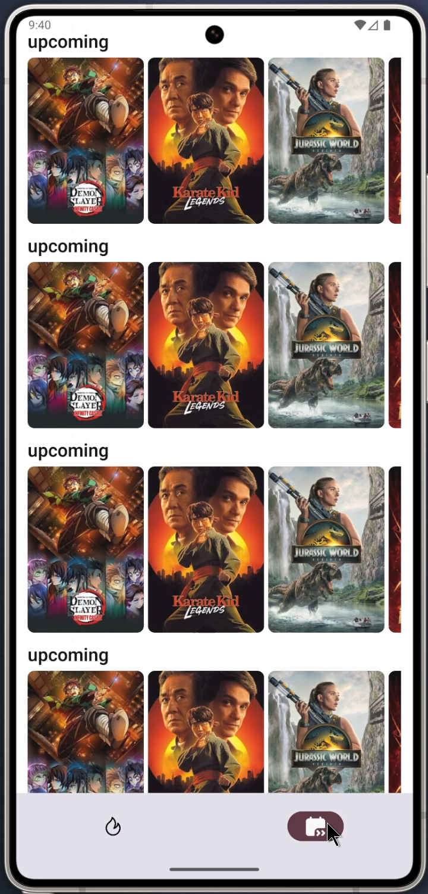

# 🎬 Recommend Me

**Recommend Me** is a simple Android app that fetches and displays movies from [The Movie Database (TMDB)](https://www.themoviedb.org/) using their public API.

This app is built as a **learning project** to understand basic API integration using Retrofit and Jetpack Compose.

---

## ✨ Features

- 📃 View **Popular Movies**
- ⏳ View **Upcoming Movies**
- 🔁 Easy Navigation between the two screens
- 🌐 Uses **Retrofit** with **GSON** for networking
- ⚙️ **Coroutines** with `LaunchedEffect` to handle API calls

---

## 🛠 Tech Stack

- **Language:** Kotlin
- **UI Framework:** Jetpack Compose
- **Networking:** Retrofit + GSON
- **Architecture:** No ViewModel or DI (for simplicity)

---

## 🎯 Purpose

This project is created purely for **learning purposes**.  
It keeps things simple by avoiding advanced tools like **ViewModel**, **Hilt**, or complex architecture.

---

## 📸 Screenshots

### 🔥 Popular Movies Screen

### ⏳ Upcoming Movies Screen

---

## 📦 API Used

- [TMDB API](https://developers.themoviedb.org/3)

> You will need to generate a free API key from TMDB and insert it into the code to fetch data **The API_KEY you will get with the project is invalid, so use yours.

---

## 🔧 Setup Instructions

1. Clone this repository
2. Insert your TMDB API key where required
3. Build and run the app on your emulator or physical device

---

## 🔮 Future Plans

- Add ViewModel and proper state handling
- Use Hilt for dependency injection
- Add movie details screen
- Implement pagination and error handling

---

## 🙏 Acknowledgements

- Thanks to [The Movie Database](https://www.themoviedb.org/) for their free and powerful movie API!
